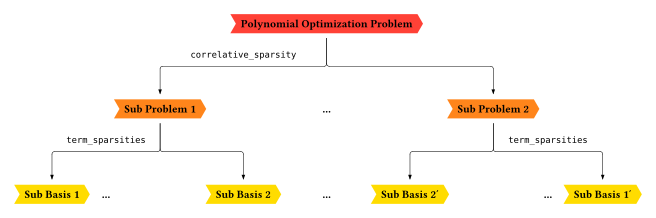
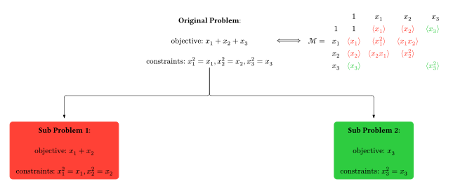

# [Sparsities](@id sparsities)
The main goal is to reduce the number of monomials used in indexing the moment
matrix. This is a crucial step in making the semidefinite programs more
efficient, as the size of the moment matrix directly affects the computational
cost of solving the problem. By exploiting the structure of the problem, we can
often significantly reduce the number of monomials needed, leading to
substantial performance improvements.



## [Correlative Sparsity](@id correlative-sparsity)

Correlative sparsity, also known as chordal sparsity, arises from the underlying
structure of the problem's variables. In many physical systems, not all
variables are directly coupled. This lack of coupling can be represented by a
graph, where the vertices are the variables and the edges represent direct
interactions. The correlative sparsity pattern is then determined by the maximal
cliques of this graph. A clique is a subset of vertices where every two distinct
vertices are adjacent. By only considering monomials within these maximal
cliques, we can significantly reduce the size of the moment matrix. This is
because the moment matrix will be block-diagonal, with each block corresponding
to a maximal clique.



### Usage (inspect cliques)

You can inspect the correlative sparsity pattern without solving an SDP:

```julia
using NCTSSoS

# Example: CHSH Bell inequality (unipotent algebra)
reg, (x, y) = create_unipotent_variables([("x", 1:2), ("y", 1:2)])
f = 1.0 * x[1] * y[1] + x[1] * y[2] + x[2] * y[1] - x[2] * y[2]
pop = polyopt(-f, reg)

# Compute sparsity only (no solve). The optimizer is not used by `compute_sparsity`.
config = SolverConfig(optimizer=nothing, order=1, cs_algo=MF(), ts_algo=NoElimination())
sparsity = compute_sparsity(pop, config)

# Variable cliques (stored as registry indices)
sparsity.corr_sparsity.cliques

# Pretty-printed summary (variables, bases, assigned constraints)
println(sparsity.corr_sparsity)
```

## [Term Sparsity](@id term-sparsity)

Term sparsity, also known as ideal sparsity, is a more direct way of exploiting
the structure of the polynomials involved in the problem. If a certain monomial
does not appear in any of the polynomial constraints, then it can be safely
removed from the basis of the moment matrix. This is because the corresponding
entry in the moment matrix will not be constrained by the problem, and thus can
be set to zero without affecting the solution. This type of sparsity is
particularly effective when the polynomials are sparse, i.e., they have only a
few non-zero terms.


